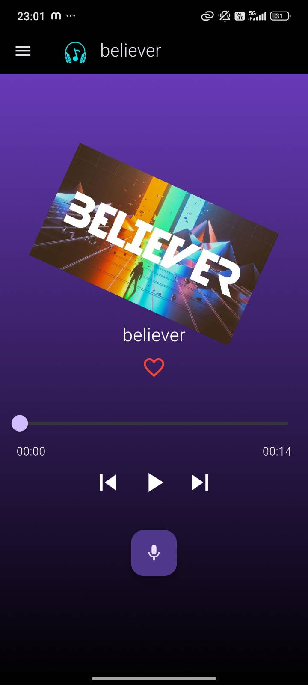
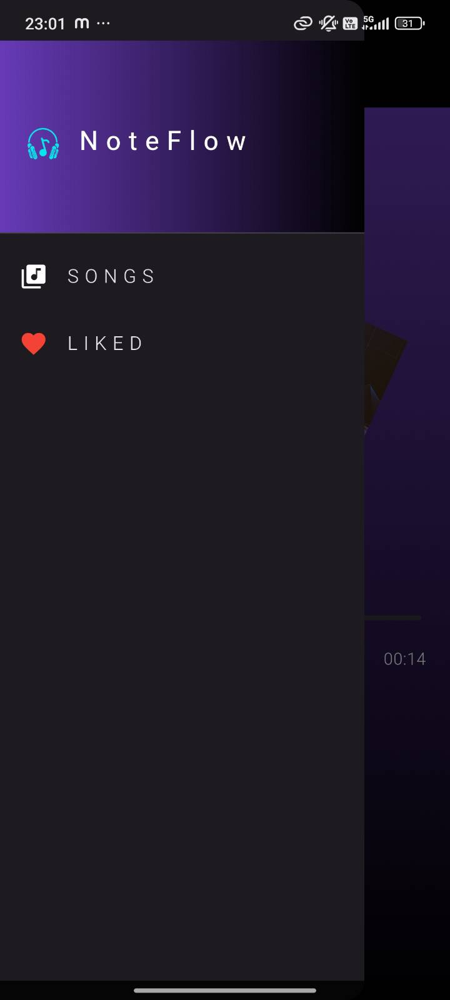

# 🎧 NoteFlow AI

An AI-Powered Mood Based Music Player built with Flutter.

NoteFlow AI intelligently understands the emotional intent behind a user’s music request using an LLM model and classifies it into a specific mood. Based on the detected mood, the app dynamically adapts the music experience.

This project focuses primarily on AI integration, prompt engineering, and intelligent interaction rather than UI responsiveness.

---

## 📦 Technologies

- Flutter
- Dart
- Groq LLM API
- HTTP Package
- Material Design
- Speech-to-Text
- Flutter TTS

---

## 🦄 Features

### 🎯 AI Mood Classification

Type or speak your music request and the AI detects the mood from the text.

Supported moods:

- relax
- focus
- happy
- love

### 🎙 Voice Input

Users can speak their mood or music request using speech recognition.

### 🧠 Prompt Engineered AI

Structured system prompts ensure the AI returns only one mood keyword for consistent results.

### 🎵 Smart Music Adaptation

Music experience dynamically adjusts based on detected mood.

### ⚡ Fast & Lightweight

Minimal UI with strong focus on AI logic and interaction.

---

## 🎯 Core Workflow

1. User enters or speaks a music request
2. Text is sent to Groq AI API
3. AI classifies emotional tone
4. App extracts mood keyword
5. Music experience adapts accordingly

---

## 👨‍🍳 The Process

The project began with integrating Groq chat completion APIs into Flutter. Instead of manually defining mood logic, AI dynamically interprets emotional context from natural language input.

A strict system prompt ensures consistent one-word mood classification. Speech-to-text and text-to-speech were added to improve interaction while maintaining focus on intelligent system behavior and clean architecture.

---

## 📚 What I Learned

### 🧠 AI Integration
Understanding structured prompts and extracting reliable outputs from LLM APIs.

### 🔄 Async Programming
Handling API requests and managing asynchronous responses efficiently in Flutter.

### 🎯 Prompt Engineering
Designing system prompts to control AI output format.

### 🎙 Voice Processing
Integrating speech recognition for real-time interaction.

### 🏗 Clean Architecture Thinking
Separating AI service logic from UI components.

---

## 💭 Future Improvements

- Integrate Spotify / YouTube Music API
- Personalized AI recommendations
- Offline mood detection model
- Animations and responsive UI
- Playlist memory based on user behavior
- Theme modes (Dark / Light / Mood-based)

---

## 🚀 Running the Project

Clone repository:

git clone https://github.com/Abinayateja/NoteFlow.git

Install dependencies:

flutter pub get

Run with API key:

flutter run --dart-define=GROQ_API_KEY=your_api_key_here

---

## 📸 Screenshots

### 🏠 Home Screen

### 🎧 Music Player / Songs Screen

### 📂 Navigation Drawer

---

## 🛡 Note

API keys are not stored in the repository.  
The app uses runtime environment variables for secure execution.
